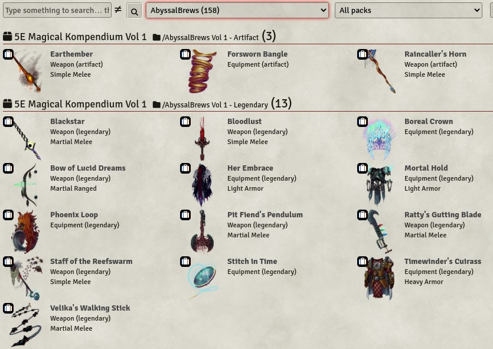
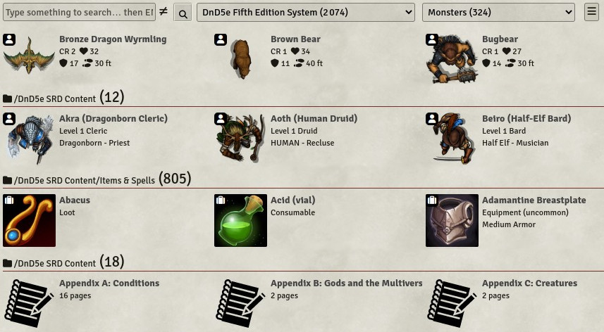
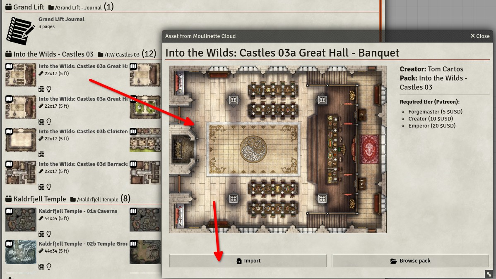

# Moulinette Compendiums (Foundry VTT)

This is a submodule for [Moulinette Core](https://github.com/SvenWerlen/moulinette-core). See [Moulinette Core](https://github.com/SvenWerlen/moulinette-core) for an overview of all modules.

https://github.com/SvenWerlen/moulinette-compendiums/assets/938060/1e43a9d3-4125-4bab-9752-63edef44d9f8

## Browse compendiums

Moulinette Compendiums enables a more user-friendly and efficient way to navigate the content of FoundryVTT compendiums.
It automatically searches for all the content in locally installed modules and systems as well as from creators you support and that are available on the [Moulinette Cloud](https://assets.moulinette.cloud/marketplace/creators).

_(Assets and artwork from <a href="https://www.patreon.com/abyssalbrews">AbyssalBrews</a>)_

## The relevant information depending on the content type

With Moulinette, you no longer need to open the sheet for each asset (item, actor, article, etc.) to find what you're looking for. The most relevant information is displayed according to the content type.

_(Assets and artwork from <a href="https://foundryvtt.com/packages/dnd5e">FoundryVTT (DnD5e system)</a>)_

## Preview and import

In just a few clicks, preview the desired content and import it into your world. Moulinette will take care of downloading all the necessary dependencies.

_(Assets and artwork from <a href="https://www.patreon.com/tomcartos">Tom Cartos</a>)_

## <a name="install"/>Install the module

To **install** the module from FoundryVTT:
1. Start FVTT and browse to the Game Modules tab in the Configuration and Setup menu
2. Search for "Moulinette Compendiums" and click install on the desired module

To **manually install** the module (not recommended), follow these instructions:

1. Start FVTT and browse to the Game Modules tab in the Configuration and Setup menu
2. Select the Install Module button and enter the following URL: https://raw.githubusercontent.com/svenwerlen/moulinette-compendiums/master/module.json
3. Click Install and wait for installation to complete 

## <a name="support"/>Support me on Patreon

If you like my work and want to support me, consider becoming a patreon!

[https://www.patreon.com/moulinette](https://www.patreon.com/moulinette)

You can also join [Moulinette Discord](https://discord.gg/xg3dcMQfP2)
